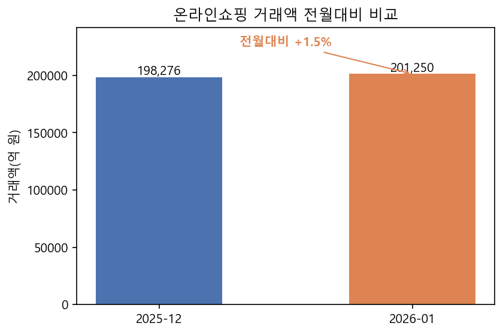
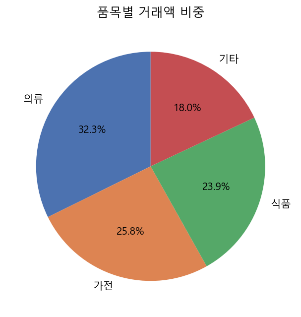
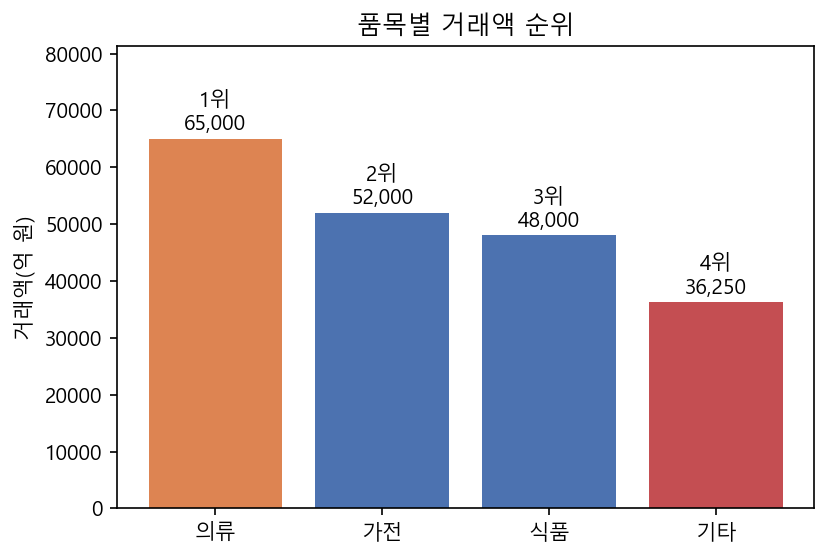
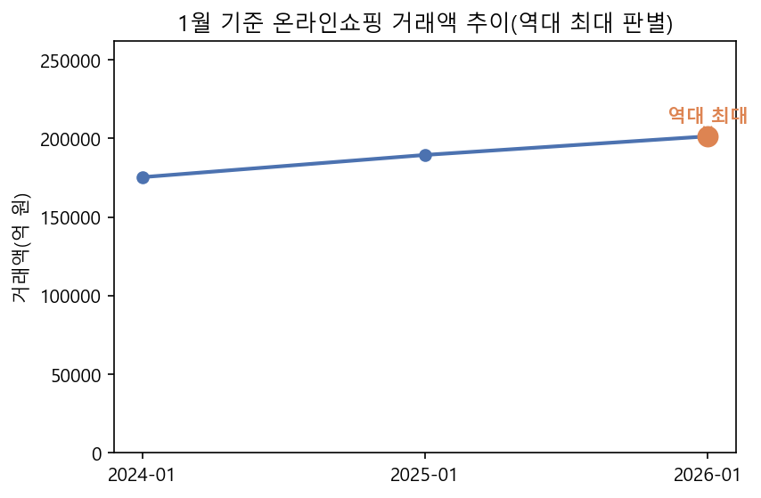

# 페이지 01. 과정명 "AI를 활용한 통계 보도자료 작성(NLP+LLM)"

---

# 페이지 02. 차시명 "Ch 05. 통계적 패턴 기반 텍스트와 통계자료 해석"

---

# 페이지 03. 도입

지금까지는 이미 문장으로 작성된 원문을 다루었다면, 이번 시간에는 순수한 숫자로만 이루어진 통계표 자체를 분석 대상으로 삼습니다. 보도자료에서 가장 중요한 것은 결국 '얼마나 늘었고 줄었는지', '어떤 항목이 가장 크고 작은지', '이 수치가 역대 최고·최저에 해당하는지'를 정확히 짚어내는 일입니다. 이러한 계산을 AI에게 맡기면 실수할 위험이 있으므로, 이번 시간에는 pandas를 이용해 증감률과 비중, 순위를 프로그램이 직접 계산하고, 임계값과 과거 이력을 기준으로 특이점을 자동으로 탐지하며, 그 결과를 정해진 문장 틀에 채워 넣어 1차 해석문을 만드는 방법을 배웁니다.

---

# 페이지 04. 학습내용, 학습목표

학습내용
1. 증감률·비중·순위 계산
2. 주요 변화와 특이점 자동 탐지
3. 통계 해석 분석 내용 생성

학습목표
1. pandas를 이용해 전월대비·전년동월대비증감률, 비중, 순위를 계산할 수 있다.
2. 임계값과 과거 이력 비교를 기준으로 특이점을 자동으로 탐지할 수 있다.
3. 특이점 유형에 맞는 해석 문장을 규칙 기반으로 자동 생성할 수 있다.

---

# 페이지 05. 소주제 1. 증감률·비중·순위 계산

---

### 페이지 06. 숫자를 의미 있는 해석으로

지금까지의 흐름과 이번 차시의 위치

- 이전 차시: 데이터를 표준 구조로 정제하고, 비정형 문장에서 키워드와 요약문을 추출·생성
- 이번 차시: 정형 데이터(통계표) 자체를 계산하고 해석하는 능력을 강화
- 목표: 표 데이터에서 증가·감소·최대·최소 항목을 찾아 설명문을 자동 생성

> **[Note]** 지금까지는 이미 문장으로 작성된 원문을 다루었다면, 이번 시간에는 순수한 숫자로만 이루어진 통계표 자체를 분석 대상으로 삼습니다. 표 안에서 어떤 항목이 늘고 줄었는지, 어떤 항목이 가장 크고 작은지를 프로그램이 직접 계산하고 해석하는 방법을 배웁니다. 오늘 배우는 내용이 사실 이 과정 전체에서 가장 핵심적인 부분이라고 해도 과언이 아닙니다. 왜냐하면 처음부터 강조해 온 "계산은 프로그램이, 문장은 AI가"라는 원칙에서 "계산" 부분을 실제로 구현하는 차시가 바로 오늘이기 때문입니다.

---

### 페이지 07. 증감률 계산의 두 가지 기준

증감률 계산 공식

- 전월대비증감률(MoM, Month-on-Month): (이번달 값 − 전월 값) ÷ 전월 값 × 100
- 전년동월대비증감률(YoY, Year-on-Year): (이번달 값 − 작년 같은달 값) ÷ 작년 같은달 값 × 100
- 두 지표는 서로 다른 의미를 가지므로 반드시 구분하여 표기해야 함

> **[Note]** 통계 보도자료에서 가장 많이 쓰이는 두 가지 증감률을 먼저 정리하겠습니다. 전월대비증감률, 영어로는 MoM은 지난달과 비교하는 지표이고, 전년동월대비증감률, 영어로는 YoY는 작년 같은 달과 비교하는 지표입니다. 계산 공식은 화면에 보시는 것처럼 각각 (이번 달 값 − 비교 시점 값) 나누기 비교 시점 값 곱하기 100입니다. 이 두 지표는 비교 기준 시점이 완전히 다르기 때문에, 예를 들어 전월대비로는 증가했지만 전년동월대비로는 오히려 감소한 경우도 얼마든지 있을 수 있습니다. 그래서 문장으로 풀어 쓸 때도 이 둘을 절대 섞어 쓰지 않고 반드시 구분해서 정확하게 표기해야 합니다.

---

### 페이지 08. Python 코드, pandas로 증감률 계산하기

pandas를 활용한 증감률 계산 실습

```python
import pandas as pd

df = pd.DataFrame({
    "연월": ["2025-12", "2026-01"],
    "거래액": [198276, 201250]
})

df["전월대비증감률"] = df["거래액"].pct_change() * 100
print(df)
#      연월     거래액  전월대비증감률
# 0  2025-12  198276        NaN
# 1  2026-01  201250   1.499...
```



> **[Note]** 방금 배운 증감률 공식을 실제 코드로 계산해 보겠습니다. pandas의 pct_change 함수를 사용하면 이전 행 대비 증감률을 단 한 줄의 코드로 계산할 수 있습니다. 화면의 예시를 보시면, 2025년 12월과 2026년 1월의 거래액 데이터가 있는 표에 pct_change를 적용하니 1월 행에 약 1.5%라는 전월대비증감률이 자동으로 계산되어 채워진 것을 볼 수 있습니다. 참고로 첫 번째 행은 비교할 이전 달이 없기 때문에 NaN, 즉 결측값으로 나오는 것이 정상입니다. 매번 수작업으로 나눗셈을 계산할 필요 없이 표 전체에 동일한 계산을 자동으로 적용할 수 있다는 것이 바로 프로그램 계산의 가장 큰 장점입니다.

---

### 페이지 09. 비중(구성비) 계산 원리와 코드

비중 계산 공식과 코드

```python
category_df = pd.DataFrame({
    "품목": ["의류", "가전", "식품", "기타"],
    "거래액": [65000, 52000, 48000, 36250]
})

category_df["비중"] = (category_df["거래액"] / category_df["거래액"].sum() * 100).round(1)
print(category_df)
```



> **[Note]** 다음으로 비중, 즉 구성비를 계산해 보겠습니다. 비중은 전체 값 중에서 특정 항목이 차지하는 비율입니다. 코드에서 보시는 것처럼, 각 품목의 거래액을 전체 거래액의 합계로 나눈 뒤 100을 곱하고 소수점 첫째 자리까지 반올림하면 됩니다. 이렇게 계산해두면 "의류가 전체의 몇 퍼센트를 차지한다"와 같은 문장을 작성할 때 근거가 되는 정확한 수치를 바로 얻을 수 있습니다.

---

### 페이지 10. 순위 산정, rank 함수 활용

Python 코드, 순위 계산과 최대·최소 항목 찾기

```python
category_df["순위"] = category_df["거래액"].rank(ascending=False).astype(int)
top1 = category_df.loc[category_df["거래액"].idxmax()]
bottom1 = category_df.loc[category_df["거래액"].idxmin()]

print(f"1위 품목: {top1['품목']} ({top1['거래액']}억 원)")
print(f"최하위 품목: {bottom1['품목']} ({bottom1['거래액']}억 원)")
```



> **[Note]** 마지막으로 순위를 계산해 보겠습니다. rank 함수에 ascending=False를 지정하면 값이 큰 순서대로 1등부터 순위를 매길 수 있습니다. 그리고 idxmax와 idxmin 함수를 쓰면 가장 크거나 가장 작은 값을 가진 항목을 즉시 찾아낼 수 있습니다. 이렇게 계산된 순위 정보는 나중에 "품목별 순위를 살펴보면 의류가 1위를 차지했다"와 같은 본문 단락을 작성할 때 핵심 근거가 됩니다. 지금까지 배운 증감률, 비중, 순위 이 세 가지가 통계 보도자료에서 가장 기본이 되는 계산이라는 것을 꼭 기억해 주세요.

---

# 페이지 11. 소주제 2. 주요 변화와 특이점 자동 탐지

---

### 페이지 12. 역대 최고, 최저 판별 로직

시계열 비교를 통한 역대 기록 판별

```python
history_df = pd.DataFrame({
    "연월": ["2024-01", "2025-01", "2026-01"],
    "거래액": [175320, 189430, 201250]
})

is_record_high = history_df["거래액"].iloc[-1] == history_df["거래액"].max()
print("역대 최대 여부:", is_record_high)  # True
```



> **[Note]** "역대 최대"라는 표현은 보도자료에서 매우 강력한 주장이기 때문에, 근거 없이 함부로 사용해서는 안 됩니다. 반드시 과거 전체 이력과 비교해서 사실인지 확인해야 합니다. 여기서 중요한 포인트는, 같은 달, 예를 들어 1월끼리만 비교한다는 것입니다. 왜냐하면 월별로 거래 규모 자체가 원래 다르기 때문에, 예를 들어 명절이 있는 달과 없는 달을 그냥 비교하면 안 되기 때문입니다. 화면의 코드처럼 과거 여러 해의 같은 달 데이터를 모아서 이번 값이 그 중 최댓값과 같은지 비교하면, "역대 1월 기준 최대치"라는 판단을 사람이 아니라 프로그램이 정확하게 자동으로 내릴 수 있습니다.

---

### 페이지 13. 특이점 자동 탐지 규칙, 임계값 기반 판단

특이점으로 분류하는 규칙 예시

- 증감률의 절댓값이 5% 이상이면 "큰 폭의 변화"로 분류
- 최근 3개월 연속 같은 방향(증가 또는 감소)이면 "지속적 추세"로 분류
- 해당 시점 기준 역대 최고/최저치를 기록하면 "특이사항"으로 최우선 분류

> **[Note]** 통계표에는 수십 개의 숫자가 있지만, 그 모든 숫자를 다 보도자료 문장으로 담을 수는 없습니다. 그래서 어떤 변화가 언급할 만큼 중요한지 판단하는 기준이 필요한데, 여기서는 세 가지 규칙을 사용합니다. 첫째, 증감률의 절댓값이 5% 이상이면 "큰 폭의 변화"로 분류합니다. 둘째, 최근 3개월 연속으로 같은 방향, 즉 계속 증가하거나 계속 감소하면 "지속적 추세"로 분류합니다. 셋째, 앞 페이지에서 배운 것처럼 해당 시점 기준으로 역대 최고나 최저치를 기록하면 이것을 가장 우선순위 높은 "특이사항"으로 분류합니다. 이 세 가지 규칙을 조합하면, 어떤 통계표가 들어와도 사람이 일일이 살펴보지 않아도 중요한 변화를 자동으로 짚어낼 수 있습니다.

---

### 페이지 14. Python 코드, 특이점 탐지 함수 구현

특이점 탐지 함수

```python
def detect_special_points(momRate: float, yoyRate: float, is_record_high: bool,
                           recent_momRates: list = None) -> list:
    points = []
    if is_record_high:
        points.append("역대 최대치 경신")
    if abs(momRate) >= 5:
        points.append(f"전월 대비 {'큰 폭 증가' if momRate > 0 else '큰 폭 감소'}")
    if abs(yoyRate) >= 5:
        points.append(f"전년동월 대비 {'큰 폭 증가' if yoyRate > 0 else '큰 폭 감소'}")
    if recent_momRates and len(recent_momRates) >= 3:
        최근3개월 = recent_momRates[-3:]
        if all(r > 0 for r in 최근3개월):
            points.append("최근 3개월 연속 증가세")
        elif all(r < 0 for r in 최근3개월):
            points.append("최근 3개월 연속 감소세")
    return points

special = detect_special_points(1.5, 8.7, True, recent_momRates=[2.0, 1.8, 1.5])
print(special)  # ['역대 최대치 경신', '전년동월 대비 큰 폭 증가', '최근 3개월 연속 증가세']
```

> **[Note]** 방금 배운 세 가지 규칙을 detect_special_points라는 함수로 구현했습니다. 전월대비증감률, 전년동월대비증감률, 역대 최대 여부, 그리고 최근 몇 개월치 전월대비증감률 목록을 입력하면, 함수 안에서 절댓값이 5% 이상인지, 최근 3개월이 모두 같은 방향인지, 역대 최대인지를 차례로 검사해서 해당하는 특이점들을 리스트로 모아 돌려줍니다. 화면 아래 예시처럼 momRate 1.5, yoyRate 8.7, is_record_high True, 그리고 최근 3개월 증감률이 모두 양수인 경우를 넣으면, "역대 최대치 경신", "전년동월 대비 큰 폭 증가", "최근 3개월 연속 증가세"라는 세 가지 특이점이 한 번에 나오는 것을 확인할 수 있습니다. 참고로 이 함수는 증가하는 경우뿐 아니라 감소하는 경우도 똑같이 감지합니다. momRate나 yoyRate가 음수이면 "큰 폭 감소"로, 최근 3개월이 모두 음수이면 "연속 감소세"로 분류됩니다. 이 목록은 다음 소주제에서 배울 해석문 생성의 직접적인 재료로 사용됩니다.

---

# 페이지 15. 소주제 3. 통계 해석 분석 내용 생성

---

### 페이지 16. 통계 해석 문장 템플릿 설계

특이점 유형별 문장 템플릿

- 역대 최대: "{연월} {지표명}은 {값}{단위}로 역대 {기준기간} 기준 최대치를 기록하였다."
- 큰 폭 증가: "{지표명}이 전월 대비 {값}% 증가하며 큰 폭의 상승세를 보였다."
- 지속적 추세: "{지표명}은 {N}개월 연속 {방향}세를 이어가고 있다."

> **[Note]** 특이점 목록까지는 만들었으니, 이제 이걸 실제 문장으로 바꾸는 방법을 배우겠습니다. 각 특이점 유형마다 미리 정해진 문장 틀, 즉 템플릿을 만들어두면 계산된 숫자를 빈칸에 채워 넣기만 해도 일관된 품질의 해석 문장을 자동으로 생성할 수 있습니다. 화면에 세 가지 템플릿 예시가 있는데요, 역대 최대 템플릿, 큰 폭 증가 템플릿, 지속적 추세 템플릿입니다. 이 방식의 핵심은, AI에게 문장 생성을 통째로 맡기는 것이 아니라 프로그램이 먼저 규칙에 따라 기본 문장을 만든다는 점입니다. 이렇게 만들어진 1차 해석문은 사실관계가 100% 보장되어 있고, 필요하다면 나중에 LLM을 통해 표현만 더 자연스럽게 다듬을 수 있습니다.

---

### 페이지 17. Python 코드, 규칙 기반 해석문 자동 생성기

템플릿에 값을 채워 문장을 만드는 함수

```python
def generate_interpretation(indicator_name: str, value: float, unit: str,
                             point_type: str) -> str:
    templates = {
        "역대 최대치 경신": f"{indicator_name}은 {value}{unit}로 역대 최대치를 기록하였다.",
        "큰 폭 증가": f"{indicator_name}이 전월 대비 {value}% 증가하며 큰 폭의 상승세를 보였다.",
    }
    return templates.get(point_type, "")

sentence = generate_interpretation("온라인쇼핑 거래액", 201250, "억 원", "역대 최대치 경신")
print(sentence)
```

> **[Note]** 방금 본 템플릿들을 실제로 채워 넣는 함수가 generate_interpretation입니다. 지표 이름, 값, 단위, 특이점 유형 이렇게 네 가지를 입력하면 templates라는 딕셔너리에서 해당하는 문장 틀을 찾아 값을 채워 넣어 반환합니다. 화면의 예시처럼 "온라인쇼핑 거래액", 201250, "억 원", "역대 최대치 경신"을 넣으면 "온라인쇼핑 거래액은 201250억 원로 역대 최대치를 기록하였다"라는 문장이 자동으로 만들어집니다. 다음 페이지에서는 이 함수가 실제로 어떤 값들에 대해 어떤 문장을 만들어내는지 표로 정리해서 보여드리겠습니다.

---

### 페이지 18. 해석문 결과 예시와 표 형태 정리

계산 결과와 생성된 해석문 대응표

| 계산지표 | 값 | 특이점 유형 | 자동 생성된 해석문 |
| --- | --- | --- | --- |
| 총거래액 | 201,250억 원 | 역대 최대치 경신 | 온라인쇼핑 거래액은 201,250억 원으로 역대 최대치를 기록하였다. |
| 전년동월대비증감률 | 8.7% | 큰 폭 증가 | 온라인쇼핑 거래액이 전년동월 대비 8.7% 증가하며 큰 폭의 상승세를 보였다. |

> **[Note]** 계산된 지표 하나하나가 어떤 특이점 유형에 해당하고, 그 결과로 어떤 문장이 자동 생성되었는지 표로 정리하면 전체 로직의 흐름을 한눈에 검토할 수 있습니다. 화면의 표를 보시면, 총거래액 201,250억 원이 역대 최대치 경신이라는 특이점과 만나서 첫 번째 문장이 만들어졌고, 전년동월대비증감률 8.7%가 큰 폭 증가라는 특이점과 만나서 두 번째 문장이 만들어진 것을 확인할 수 있습니다. 이렇게 표로 검토하는 습관을 들이면, 나중에 특이점 판단 기준이나 문장 템플릿을 수정할 때도 어디를 고쳐야 할지 훨씬 명확하게 파악할 수 있습니다.

---

### 페이지 19. 오류 방지, %와 %p 구분 검증 로직

퍼센트(%)와 퍼센트포인트(%p) 자동 구분 검증

```python
def check_percent_unit(text: str, is_rate_of_rate: bool) -> bool:
    if is_rate_of_rate and "%p" not in text:
        return False  # 비중 변화인데 %p를 쓰지 않은 경우 오류
    if not is_rate_of_rate and "%p" in text:
        return False  # 단순 증감률인데 %p를 잘못 사용한 경우 오류
    return True
```

> **[Note]** 통계 보도자료에서 실무자들이 자주 실수하는 부분이 바로 %와 %p의 구분입니다. 비중, 즉 구성비가 예를 들어 32%에서 35%로 변화했다면 그 차이는 3%가 아니라 3%p로 표기해야 합니다. 이 미묘한 차이는 사람이 눈으로 검토할 때도 실수하기 쉬운 부분입니다. 그래서 check_percent_unit이라는 검증 함수를 만들어서, 비중 변화를 설명하는 문장인데 %p가 없거나, 반대로 단순 증감률인데 %p를 잘못 사용한 경우를 자동으로 점검하도록 만들었습니다. 이렇게 코드로 사전에 차단해두면 오류가 최종 보도자료까지 흘러가는 것을 막을 수 있습니다.

---

### 페이지 20. 해석 결과를 표준 데이터 구조에 반영

표준 JSON 확장, 통계해석결과 필드 추가

```json
{
  "계산지표": { "총거래액": 201250, "전년동월대비증감률": 8.7 },
  "통계해석결과": {
    "특이점목록": ["역대 최대치 경신", "전년동월 대비 큰 폭 증가"],
    "해석문장": [
      "온라인쇼핑 거래액은 201,250억 원으로 역대 최대치를 기록하였다.",
      "온라인쇼핑 거래액이 전년동월 대비 8.7% 증가하며 큰 폭의 상승세를 보였다."
    ]
  }
}
```

> **[Note]** 지금까지 프로그램이 계산하고 규칙 기반으로 생성한 해석 문장을 "통계해석결과"라는 새로운 필드로 표준 데이터에 저장합니다. 이 필드 안에는 특이점목록과 해석문장이 나란히 담기게 됩니다. 이렇게 저장된 결과는 이후 차시의 그래프 설명문 작성과 리드문 작성에서 이미 검증이 끝난 사실 근거로 그대로 활용됩니다. 즉 오늘 이 시간이 앞으로 이어질 모든 AI 문장 생성 작업의 사실적 기반을 만드는 시간이라고 보시면 됩니다.

---

### 페이지 21. Python 코드, add_calculated_indicators 함수로 통합

```python
def build_interpretation_sentences(특이점: list, 계산지표: dict, 지표명: str = "거래액") -> list:
    """특이점목록과 계산지표로부터 해석문장 목록을 만든다."""
    해석문장 = []
    if "역대 최대치 경신" in 특이점:
        해석문장.append(generate_interpretation(지표명, 계산지표["총거래액"], "억 원", "역대 최대치 경신"))
    # 증가/감소, 전월/전년동월을 각각 구분해 값을 매핑한다. 감소 방향은 abs()로
    # 부호를 뗀 값을 "감소" 전용 템플릿에 채운다 — 부호를 그대로 두면
    # "거래액이 -6% 감소하며..."처럼 이중 부정이 되어 버린다.
    if "전월 대비 큰 폭 증가" in 특이점:
        해석문장.append(generate_interpretation("거래액", 계산지표["전월대비증감률"], "%", "전월 대비 큰 폭 증가"))
    if "전월 대비 큰 폭 감소" in 특이점:
        해석문장.append(generate_interpretation("거래액", abs(계산지표["전월대비증감률"]), "%", "전월 대비 큰 폭 감소"))
    if "전년동월 대비 큰 폭 증가" in 특이점:
        해석문장.append(generate_interpretation("거래액", 계산지표["전년동월대비증감률"], "%", "전년동월 대비 큰 폭 증가"))
    if "전년동월 대비 큰 폭 감소" in 특이점:
        해석문장.append(generate_interpretation("거래액", abs(계산지표["전년동월대비증감률"]), "%", "전년동월 대비 큰 폭 감소"))
    if "최근 3개월 연속 증가세" in 특이점:
        해석문장.append(generate_interpretation("거래액", 0, "%", "최근 3개월 연속 증가세"))
    if "최근 3개월 연속 감소세" in 특이점:
        해석문장.append(generate_interpretation("거래액", 0, "%", "최근 3개월 연속 감소세"))
    return 해석문장


def add_calculated_indicators(data: dict) -> dict:
    """표준 데이터의 원본 수치를 바탕으로 계산지표, 통계해석결과 필드를 채운다."""
    지표 = data["계산지표"]
    is_record_high = data.get("역대최대여부", False)

    특이점 = detect_special_points(
        momRate=지표["전월대비증감률"],
        yoyRate=지표["전년동월대비증감률"],
        is_record_high=is_record_high,
        recent_momRates=data.get("최근3개월증감률"),
    )

    지표명 = data["문서정보"]["제목"].split()[-1] or "거래액"
    해석문장 = build_interpretation_sentences(특이점, 지표, 지표명)

    data["통계해석결과"] = {"특이점목록": 특이점, "해석문장": 해석문장}
    return data
```

> **[Note]** 지금까지 이 차시에서 만든 계산·탐지·해석 코드를 하나로 통합한 것이 add_calculated_indicators 함수입니다. 이 함수는 표준 데이터 하나를 통째로 입력받아서, 내부적으로 detect_special_points로 특이점을 탐지하고, build_interpretation_sentences라는 별도 함수를 호출해서 해석문장까지 채운 뒤 반환합니다. 여기서 build_interpretation_sentences를 따로 분리해 둔 이유는, 이 로직이 온라인쇼핑 동향 예시뿐 아니라 다른 통계표를 다루는 예시에서도 똑같이 재사용되기 때문입니다. 이 함수 안의 여섯 가지 분기를 주목해 주세요. 증가와 감소, 전월대비와 전년동월대비, 그리고 연속 증가세와 연속 감소세까지, 앞서 detect_special_points가 감지할 수 있는 모든 특이점 유형에 대해 빠짐없이 해석문장을 만들어냅니다. 특히 감소 방향일 때는 abs 함수로 부호를 뗀 값을 사용하는데, 그렇지 않으면 "거래액이 -6% 감소하며"처럼 마이너스 부호와 "감소"라는 단어가 겹쳐서 이중 부정이 되는 어색한 문장이 나오기 때문입니다. 이 여섯 가지 경우를 모두 빠짐없이 처리하는 것이, 실제 통계에서는 항상 증가만 하는 것이 아니라 감소하는 달도 있기 때문에 매우 중요합니다.

---

### 페이지 22. Python 코드, 역대 최대·최근 추세 자동 계산 (derive_history_indicators)

```python
def _shift_month(ym: str, delta_months: int) -> str:
    """"YYYY-MM" 문자열을 delta_months만큼 이동시킨다 (음수면 과거로)."""
    year, month = (int(part) for part in ym.split("-"))
    total = year * 12 + (month - 1) + delta_months
    new_year, new_month0 = divmod(total, 12)
    return f"{new_year:04d}-{new_month0 + 1:02d}"


def derive_history_indicators(history: list, current_ym: str, current_value: float) -> dict:
    """과거 월별 시계열과 이번 달 값만으로 4가지 지표를 전부 자동 계산한다:
    전월대비증감률, 전년동월대비증감률, 역대최대여부, 최근3개월증감률.

    history: [{"연월": "YYYY-MM", "값": 숫자}, ...] 순서 무관, 이번 달 제외.
    전월/전년동월 값이 history에 없으면 그 증감률은 None으로 반환한다.
    과거 이력이 아예 없으면 역대최대여부는 True로 간주한다(비교 대상이 없으므로).
    """
    if not history:
        return {
            "역대최대여부": True, "최근3개월증감률": [],
            "전월대비증감률": None, "전년동월대비증감률": None,
        }

    현재_월 = current_ym.split("-")[1]
    같은달_과거값 = [h["값"] for h in history if h["연월"].split("-")[1] == 현재_월]
    역대최대여부 = current_value >= max(같은달_과거값) if 같은달_과거값 else True

    전체 = sorted(history + [{"연월": current_ym, "값": current_value}], key=lambda h: h["연월"])
    최근3개월증감률 = []
    for i in range(max(1, len(전체) - 3), len(전체)):
        이전값, 이번값 = 전체[i - 1]["값"], 전체[i]["값"]
        if 이전값:
            최근3개월증감률.append(round((이번값 - 이전값) / 이전값 * 100, 1))

    history_map = {h["연월"]: h["값"] for h in history}

    def _rate_vs(ym: str):
        기준값 = history_map.get(ym)
        return round((current_value - 기준값) / 기준값 * 100, 1) if 기준값 else None

    return {
        "역대최대여부": 역대최대여부,
        "최근3개월증감률": 최근3개월증감률,
        "전월대비증감률": _rate_vs(_shift_month(current_ym, -1)),
        "전년동월대비증감률": _rate_vs(_shift_month(current_ym, -12)),
    }
```

> **[Note]** 이번에는 add_calculated_indicators가 입력으로 받는 "역대최대여부"와 "최근3개월증감률", 그리고 "전월대비/전년동월대비증감률" 자체를 과거 이력만으로 자동 계산하는 함수를 보여드리겠습니다. 바로 derive_history_indicators입니다. 이 함수는 과거 월별 실적 목록인 history와 이번 달 연월, 이번 달 값만 입력받아서 네 가지 지표를 전부 계산합니다. 같은 달의 과거 값들만 골라 최댓값과 비교해서 역대최대여부를 판단하고, 전체 이력을 연월 순으로 정렬한 뒤 최근 구간의 증감률을 계산해서 최근3개월증감률을 만들고, _shift_month라는 보조 함수로 전월과 작년 같은 달의 연월을 계산한 뒤 그 값을 history에서 찾아 전월대비증감률과 전년동월대비증감률까지 계산합니다. 만약 전월이나 전년동월에 해당하는 값이 history 안에 없다면, 이 함수는 0이나 임의의 값으로 조용히 채우지 않고 None을 반환합니다. 계산할 수 없는 상황이라는 것을 호출하는 쪽이 명확하게 알 수 있도록 하기 위해서입니다. 이 함수 하나만 있으면, 담당자가 "이번 달이 역대 최대인지 아닌지"를 직접 조사해서 입력할 필요 없이, 과거 이력 데이터만 준비되어 있으면 프로그램이 전부 알아서 판단할 수 있게 됩니다.

---

### 페이지 23. Python 코드, 원자료가 "집계 전 개별 기록"일 때 (aggregate_sample_sales)

```python
from collections import defaultdict

def aggregate_sample_sales(표본매출: list) -> list:
    """표본 사업체별 매출 신고를 품목별로 합산해 당월거래액·비중·순위를 계산한다.

    표본매출: [{"업체명": str, "품목": str, "매출액": 숫자}, ...] — 합계·비중·순위는
    이 함수를 거치기 전까지 어디에도 존재하지 않는다.
    """
    품목별합계 = defaultdict(float)
    for row in 표본매출:
        품목별합계[row["품목"]] += row["매출액"]

    총매출 = sum(품목별합계.values())
    품목별지표 = [
        {"품목": 품목, "당월거래액": int(round(값)), "비중": round(값 / 총매출 * 100, 1)}
        for 품목, 값 in 품목별합계.items()
    ]
    품목별지표.sort(key=lambda row: row["당월거래액"], reverse=True)
    for 순위, row in enumerate(품목별지표, start=1):
        row["순위"] = 순위
    return 품목별지표

표본매출 = [
    {"업체명": "펫프렌즈샵", "품목": "사료", "매출액": 4200},
    {"업체명": "우리동물마트", "품목": "사료", "매출액": 3800},
    {"업체명": "도그캣플러스", "품목": "간식", "매출액": 3000},
    # ... (총 23개 업체)
]
품목별지표 = aggregate_sample_sales(표본매출)
```

> **[Note]** 지금까지 이 차시의 모든 예시는 category_df처럼 "당월거래액"이라는 열이 이미 표에 정리되어 있다고 가정했습니다. 그런데 실제 통계 생산 현장에서는 그 표 자체가 처음부터 존재하지 않는 경우가 많습니다. 예를 들어 통계청의 온라인쇼핑 동향도 모든 소비자의 거래를 하나하나 전수조사하는 것이 아니라, 표본으로 선정된 여러 사업체가 신고한 매출을 취합해서 만듭니다. 이렇게 "표본 사업체별 매출 신고"라는 집계 전 원자료만 있을 때는, 품목별 합계와 비중, 순위를 직접 계산하는 코드가 필요합니다. aggregate_sample_sales 함수가 바로 그 역할을 합니다. 표본매출이라는, 업체명·품목·매출액만 있는 개별 신고 목록을 입력받아서, defaultdict로 품목별 합계를 먼저 구하고, 전체 합계로 나누어 비중을 계산하고, 매출액 기준으로 정렬해서 순위까지 매깁니다. 이렇게 계산된 품목별지표와 앞서 배운 derive_history_indicators의 결과를 합치면, "표본매출"과 "이력"이라는 진짜 원자료 두 가지만으로 add_calculated_indicators가 하던 모든 계산을 대체할 수 있습니다. 즉 오늘 배운 계산 원칙은 이미 정리된 표에서 시작하든, 아직 집계도 되지 않은 개별 기록에서 시작하든 똑같이 적용된다는 것을 보여드리는 예시입니다.

---

### 페이지 24. 정리하기

1. pandas를 이용한 증감률·비중·순위 계산
  - 전월대비·전년동월대비증감률, 품목별 비중, 순위를 pandas의 pct_change·sum·rank 같은 함수로 정확하게 계산하는 방법을 익혔습니다.
  - 사람이 매번 나눗셈을 손으로 계산하지 않아도, 표 전체에 동일한 계산을 자동으로 적용할 수 있다는 프로그램 계산의 장점을 확인했습니다.
2. 임계값과 이력 비교를 통한 특이점 자동 탐지
  - 증감률 절댓값 5% 이상, 최근 3개월 연속 같은 방향, 역대 최고·최저치라는 세 가지 규칙으로 언급할 만큼 중요한 변화를 자동으로 찾아내는 방법을 배웠습니다.
  - detect_special_points와 derive_history_indicators 함수로, 과거 이력 데이터만 있으면 역대 최대 여부까지 프로그램이 스스로 판단하게 만들었습니다.
3. 계산 결과를 해석 문장으로 자동 변환
  - 특이점 유형별로 미리 정해둔 문장 템플릿에 계산된 값을 채워 넣어, 사실관계가 100% 보장된 1차 해석문을 자동 생성하는 방법을 배웠습니다.
  - add_calculated_indicators 함수로 계산·탐지·해석 과정을 하나로 통합했고, %와 %p를 혼동하는 오류를 코드로 사전에 차단하는 방법도 함께 익혔습니다.

---

### 페이지 25. 참고자료

- Anthropic Claude 공식 사용 가이드: https://docs.anthropic.com/
- Claude Code 사용법: https://docs.anthropic.com/claude-code/
- KOSIS 국가통계포털: https://kosis.kr/
- MDIS 마이크로데이터 통합서비스: https://mdis.mods.go.kr/
- SGIS 통계지리정보서비스: https://sgis.mods.go.kr/
- 통계청 공식 홈페이지 (통계 공표 및 보도자료): https://kostat.go.kr/
- 대한민국 정책브리핑 (공공 보도자료 작성 및 브리핑): https://www.korea.kr/
- 국가법령정보센터 (통계법 제27조의2 - 공표 전 통계 보안): https://www.law.go.kr/
- 국가정보원 (국가·공공기관 생성형 AI 활용 보안 가이드라인): https://www.nis.go.kr/
- 개인정보보호위원회 (개인정보 보호 및 마스킹 수칙): https://www.pipc.go.kr/
