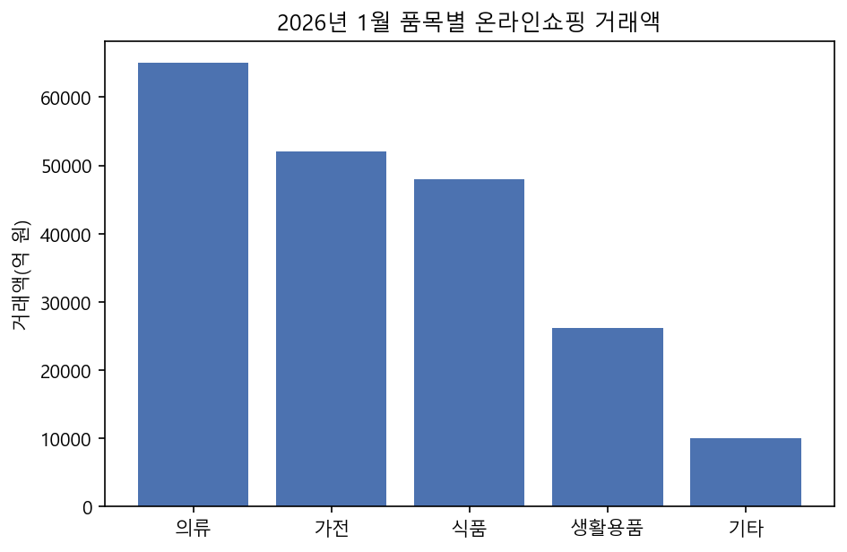
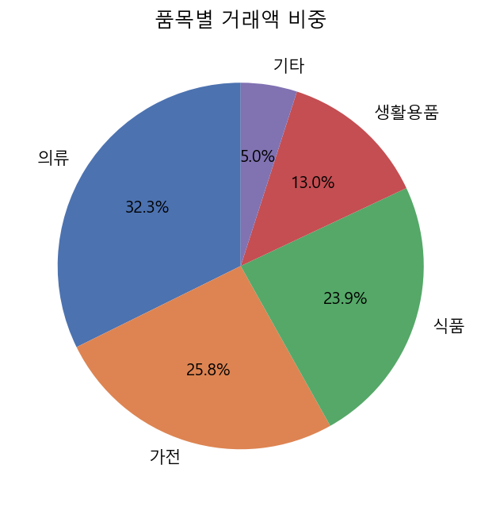

# 페이지 01. 과정명 "AI를 활용한 통계 보도자료 작성(NLP+LLM)"

---

# 페이지 02. 차시명 "Ch 06. 표, 그래프 기반 설명문 자동 생성 실습"

---

# 페이지 03. 도입

이전 차시에서 계산한 증감률과 순위 같은 지표는 숫자만으로는 한눈에 와닿지 않을 때가 많습니다. 보도자료에는 그래서 항상 표와 그래프가 함께 실립니다. 이번 시간에는 계산된 지표를 막대, 꺾은선, 원형 그래프로 시각화하는 방법과, 각 그래프가 어떤 이야기를 담고 있는지를 다시 문장으로 풀어내는 방법을 배웁니다. 같은 데이터라도 그래프 유형에 따라 강조해야 할 포인트가 다르다는 것, 그리고 그 설명문에는 반드시 '무엇에 대한 설명인지'가 분명히 드러나야 한다는 것이 이번 시간의 핵심입니다.

---

# 페이지 04. 학습내용, 학습목표

학습내용
1. 표·그래프 구성
2. 그래프 유형별 설명문 템플릿 설계
3. 표·그래프 설명문 생성 기능 구현

학습목표
1. matplotlib으로 막대·꺾은선·원형 그래프를 생성할 수 있다.
2. 그래프 유형에 맞는 설명 포인트를 구분하고 문장 템플릿을 설계할 수 있다.
3. 그래프 데이터를 입력받아 설명문을 자동으로 생성하는 함수를 구현할 수 있다.

---

# 페이지 05. 소주제 1. 표·그래프 구성

---

### 페이지 06. 숫자를 그림으로, 그림을 다시 문장으로

이번 차시 흐름

- 이전 차시에서 계산한 지표(증감률, 비중, 순위)를 실제 그래프로 시각화
- 그래프의 형태(추세, 비교, 비중)에 따라 다른 설명 방식이 필요함을 이해
- 목표: 엑셀 표 또는 그래프 데이터를 자연스러운 설명문으로 변환

> **[Note]** 숫자로 가득한 표는 한눈에 파악하기 어렵기 때문에 보도자료에는 항상 그래프가 함께 제공됩니다. 이번 시간에는 이전 차시에서 계산한 지표를 실제로 그래프로 그리는 방법과, 그 그래프가 담고 있는 의미를 다시 문장으로 풀어 설명하는 방법을 함께 배웁니다. 오늘 배울 내용은 결국 "그래프를 문장으로 바꾸는 자동 번역기"를 만드는 것이라고 생각하시면 이해가 쉽습니다.

---

### 페이지 07. 통계 보도자료에 자주 쓰이는 3가지 그래프 유형

그래프 유형별 용도

- 막대그래프(Bar Chart): 여러 항목의 크기를 서로 비교할 때 사용 (예: 품목별 거래액 비교)
- 꺾은선그래프(Line Chart): 시간에 따른 값의 변화, 추세를 보여줄 때 사용 (예: 월별 거래액 추이)
- 원형그래프(Pie Chart): 전체에서 각 항목이 차지하는 비중을 보여줄 때 사용 (예: 품목별 구성비)

> **[Note]** 어떤 데이터를 어떤 그래프로 그릴지 정하는 것이 오늘 배울 설명문 작성의 출발점입니다. 세 가지 유형을 정리하면, 항목 간 크기를 비교하려면 막대그래프를 씁니다. 예를 들어 품목별 거래액을 나란히 비교할 때입니다. 시간에 따른 흐름을 보여주려면 꺾은선그래프를 씁니다. 월별 거래액 추이가 대표적입니다. 그리고 전체 대비 비중을 보여주려면 원형그래프를 씁니다. 품목별 구성비가 여기에 해당합니다. 이 세 가지 유형을 헷갈리지 않고 상황에 맞게 고르는 것이 첫 단추입니다.

---

### 페이지 08. Python 코드, matplotlib으로 그래프 생성하기

matplotlib을 활용한 막대그래프 생성

```python
import os
import matplotlib.pyplot as plt

os.makedirs("images", exist_ok=True)  # images 폴더가 없으면 savefig가 실패하므로 미리 생성
plt.rc("font", family="Malgun Gothic")  # 한글 폰트 설정

품목 = ["의류", "가전", "식품", "생활용품", "기타"]
거래액 = [65000, 52000, 48000, 26250, 10000]

plt.bar(품목, 거래액, color="#4C72B0")
plt.title("2026년 1월 품목별 온라인쇼핑 거래액")
plt.ylabel("거래액(억 원)")
plt.savefig("images/품목별_거래액.png", dpi=150, bbox_inches="tight")
```



> **[Note]** matplotlib이라는 파이썬 라이브러리를 이용하면 이렇게 몇 줄의 코드만으로 그래프를 그릴 수 있습니다. 코드에서 먼저 images 폴더를 만들고, 한글이 깨지지 않도록 맑은 고딕 폰트를 설정한 다음, 품목과 거래액 데이터를 막대그래프로 그리고 제목과 축 이름을 붙여서 이미지 파일로 저장합니다. 이렇게 완성된 그래프는 이미지 파일로 저장되기 때문에 이후 최종 문서에 삽입할 수 있도록 준비가 됩니다.

---

# 페이지 09. 소주제 2. 그래프 유형별 설명문 템플릿 설계

---

### 페이지 10. 그래프 유형별 설명 포인트 정리

유형별로 짚어야 할 핵심 요소

- 막대그래프: 가장 큰 항목과 가장 작은 항목, 그 격차
- 꺾은선그래프: 전반적인 추세 방향(상승/하락/보합), 변곡점이 있는 시점
- 원형그래프: 가장 큰 비중을 차지하는 항목, 상위 항목들의 누적 비중

> **[Note]** 같은 데이터라도 그래프 유형에 따라 독자에게 강조해야 할 포인트가 다릅니다. 막대그래프에서는 가장 큰 항목과 가장 작은 항목, 그리고 그 격차를 짚어주어야 합니다. 꺾은선그래프에서는 전반적인 추세 방향, 즉 상승인지 하락인지 보합인지와, 특별히 변곡점이 있었던 시점을 짚어주어야 합니다. 원형그래프에서는 가장 큰 비중을 차지하는 항목과, 상위 항목들을 합쳤을 때의 누적 비중을 짚어주어야 합니다. 다음 세 페이지에서 이 세 가지 포인트를 실제 문장 템플릿으로 만들어보겠습니다.

---

### 페이지 11. 꺾은선그래프(추세) 설명문 템플릿

추세 설명문 템플릿과 예시

```
템플릿: "{지표명}은 {시작시점}부터 {종료시점}까지 {추세방향}세를 보이고 있으며,
{특이시점}에 {특이내용}을 기록하였다."

예시: "온라인쇼핑 거래액은 2025년 10월부터 2026년 1월까지 꾸준한 증가세를 보이고 있으며,
2026년 1월에 역대 최대치를 기록하였다."
```

> **[Note]** 꺾은선그래프는 시간의 흐름 자체가 핵심 정보이므로, 시작 시점부터 종료 시점까지의 전반적인 방향과 그중 특별히 짚어야 할 시점을 함께 서술하는 템플릿을 사용합니다. 화면의 예시처럼 "지표명은 시작시점부터 종료시점까지 추세방향세를 보이고 있으며, 특이시점에 특이내용을 기록하였다"라는 틀에 실제 값을 채워 넣으면 됩니다. 이 템플릿에서 가장 중요한 부분은 맨 앞의 "지표명"입니다. 이 지표명이 빠지면 이 문장이 정확히 무엇에 대한 추세를 말하는지 알 수 없게 되므로, 잠시 후 코드로 구현할 때 반드시 이 지표명을 명시적으로 채워 넣도록 만들겠습니다.

---

### 페이지 12. 막대그래프(비교) 설명문 템플릿

비교 설명문 템플릿과 예시

```
템플릿: "{항목1}이 {값1}로 가장 높았으며, {항목2}이 {값2}로 그 뒤를 이었다.
반면 {최하위항목}은 {최하위값}으로 가장 낮은 수준을 보였다."

예시: "의류가 65,000억 원으로 가장 높았으며, 가전이 52,000억 원으로 그 뒤를 이었다.
반면 기타 품목은 10,000억 원으로 가장 낮은 수준을 보였다."
```


> **[Note]** 막대그래프 설명문은 순위가 높은 항목부터 순서대로 언급하며 격차를 자연스럽게 드러내는 방식으로 구성합니다. 화면의 예시처럼 1위 항목과 값, 2위 항목과 값을 먼저 말하고, 반대로 가장 낮은 항목과 값을 마지막에 대비시켜 언급합니다. 이전 차시에서 이미 계산해둔 순위 정보를 그대로 이 템플릿에 대입하기만 하면 되므로, 별도의 추가 계산 없이 바로 문장을 만들 수 있습니다.

---

### 페이지 13. 원형그래프(비중) 설명문 템플릿

비중 설명문 템플릿과 예시

```
템플릿: "품목별 비중을 살펴보면 {1위항목}이 전체의 {1위비중}%로 가장 큰 비중을 차지하였으며,
{2위항목}({2위비중}%), {3위항목}({3위비중}%)이 그 뒤를 이었다."

예시: "품목별 비중을 살펴보면 의류가 전체의 32.4%로 가장 큰 비중을 차지하였으며,
가전(25.9%), 식품(23.9%)이 그 뒤를 이었다."
```



> **[Note]** 원형그래프는 전체 대비 각 조각의 크기가 핵심이므로, 비중이 큰 순서대로 상위 항목들을 나열하며 퍼센트 수치를 함께 밝히는 방식으로 서술합니다. 화면의 예시처럼 1위, 2위, 3위 순서로 항목명과 비중을 괄호로 붙여가며 나열하면, 독자가 전체 구성이 어떻게 나뉘어 있는지 한 문장으로 파악할 수 있습니다.

---

# 페이지 14. 소주제 3. 표·그래프 설명문 생성 기능 구현

---

### 페이지 15. Python 코드, 그래프 데이터를 설명문으로 자동 변환

그래프 유형별 설명문 생성 함수

```python
def generate_chart_description(chart_type: str, data: pd.DataFrame, label: str = None) -> str:
    if chart_type == "bar":
        sorted_df = data.sort_values("당월거래액", ascending=False)
        top, second, last = sorted_df.iloc[0], sorted_df.iloc[1], sorted_df.iloc[-1]
        return (f"{top['품목']}이 {top['당월거래액']:,}억 원으로 가장 높았으며, "
                f"{second['품목']}이 {second['당월거래액']:,}억 원으로 그 뒤를 이었다. "
                f"반면 {last['품목']}은 {last['당월거래액']:,}억 원으로 가장 낮은 수준을 보였다.")
    elif chart_type == "pie":
        sorted_df = data.sort_values("비중", ascending=False)
        top3 = sorted_df.iloc[:3]
        return (f"품목별 비중을 살펴보면 {top3.iloc[0]['품목']}이 전체의 {top3.iloc[0]['비중']}%로 "
                f"가장 큰 비중을 차지하였으며, {top3.iloc[1]['품목']}({top3.iloc[1]['비중']}%), "
                f"{top3.iloc[2]['품목']}({top3.iloc[2]['비중']}%)이 그 뒤를 이었다.")
    elif chart_type == "line":
        sorted_df = data.sort_values("연월")
        시작, 종료 = sorted_df.iloc[0], sorted_df.iloc[-1]
        추세방향 = "증가" if 종료["거래액"] > 시작["거래액"] else "감소"
        주어 = label or "총거래액"
        return (f"{주어}은 {시작['연월']}부터 {종료['연월']}까지 {추세방향}세를 보이고 있으며, "
                f"{종료['연월']}에 {종료['거래액']:,}억 원을 기록하였다.")
```

> **[Note]** 지금까지 배운 세 가지 템플릿을 하나의 함수로 구현한 것이 generate_chart_description입니다. 그래프 유형과 데이터프레임을 입력하면, 해당 유형에 맞는 템플릿에 자동으로 값을 채워 넣어 설명문을 생성합니다. 여기서 특히 주목해서 봐주셔야 할 부분이 line 분기의 "주어" 변수입니다. label이라는 인자를 받아서, 이게 있으면 그 값을, 없으면 기본값인 "총거래액"을 문장의 맨 앞 주어로 사용하도록 만들어 두었습니다. 이렇게 주어를 명시적으로 챙기는 이유가 있습니다. 만약 이 문장에 주어가 없이 "2024년부터 2026년까지 증가세를 보이고 있으며..."처럼 애매하게 만들어지면, 나중에 이후 차시에서 이 설명문을 AI가 본문 단락으로 확장할 때 AI가 "이게 정확히 무엇에 대한 추세지?"라고 혼자 추측하다가 전혀 엉뚱한 주제를 지어내는 환각을 일으킬 수 있기 때문입니다. 그래서 그래프 설명문을 만들 때는 막대·원형·꺾은선 그래프 모두 예외 없이 "무엇에 대한 설명인지"가 문장 안에 항상 명확하게 드러나도록 설계하는 것이 매우 중요합니다.

---

### 페이지 16. LLM을 활용한 그래프 설명문 자연스럽게 다듬기

설명문 확장 프롬프트 예시

```
다음 규칙 기반 설명문을 보도자료 문체로 자연스럽게 다듬어 주세요.
단, 새로운 숫자나 사실을 추가하지 말고 문장 표현만 개선하십시오.

원문: "의류가 65,000억 원으로 가장 높았으며, 가전이 52,000억 원으로 그 뒤를 이었다.
반면 기타 품목은 10,000억 원으로 가장 낮은 수준을 보였다."
```

> **[Note]** 규칙 기반 템플릿으로 만든 문장은 사실관계는 정확하지만 다소 기계적으로 느껴질 수 있습니다. 이럴 때는 이 문장을 다시 LLM에 전달해서, 사실은 그대로 유지한 채 표현만 자연스럽게 다듬어달라고 요청합니다. 프롬프트에서 "새로운 숫자나 사실을 추가하지 말고 문장 표현만 개선하라"는 제약 조건을 명확히 넣는 것이 핵심입니다. 이렇게 하면 정확성과 가독성을 모두 갖춘 설명문을 얻을 수 있습니다.

---

### 페이지 17. 표 데이터 설명문 생성 실습

표 형태 설명문 생성 예시

```python
def generate_table_description(data: pd.DataFrame) -> str:
    lines = []
    for _, row in data.sort_values("순위").iterrows():
        lines.append(f"{row['순위']}위 {row['품목']}({row['비중']}%)")
    return "품목별 순위는 " + ", ".join(lines) + " 순으로 나타났다."
```

> **[Note]** 그래프뿐 아니라 표 자체를 설명하는 문장도 똑같은 방식으로 자동화할 수 있습니다. generate_table_description 함수는 순위 컬럼을 기준으로 정렬한 뒤, 각 행의 순위·품목·비중 정보를 이어 붙여서 "품목별 순위는 1위 의류, 2위 가전... 순으로 나타났다"처럼 표 전체를 요약하는 한 문장을 완성합니다.

---

### 페이지 18. 결과 예시, 그래프와 설명문 세트 완성

완성된 그래프-설명문 세트

- 그래프 이미지: `images/품목별_거래액.png` (막대그래프)
- 자동 생성 설명문: "의류가 65,000억 원으로 가장 높았으며, 가전이 52,000억 원으로 그 뒤를 이었다. 반면 기타 품목은 10,000억 원으로 가장 낮은 수준을 보였다."
- LLM 다듬기 결과: "품목별로는 의류가 6조 5,000억 원으로 가장 많이 거래되었고, 가전이 그 뒤를 이었다. 기타 품목의 거래액은 상대적으로 가장 낮은 수준에 머물렀다."


> **[Note]** 지금까지 만든 그래프와 설명문이 실제로 어떻게 세트로 완성되는지 정리한 화면입니다. 같은 데이터를 두고 규칙 기반으로 만든 1차 설명문과, LLM이 다듬은 2차 설명문을 나란히 비교해보면, 사실관계는 동일하게 유지되면서 표현만 더 자연스러워졌다는 것을 확인할 수 있습니다. 예를 들어 "65,000억 원"이 "6조 5,000억 원"으로 자연스럽게 풀어써진 것을 보실 수 있는데, 이 역시 숫자 자체는 바뀌지 않고 표현 방식만 달라졌다는 점이 중요합니다.

---

### 페이지 19. 그래프 설명문을 표준 데이터 구조에 반영

표준 JSON 확장, 시각자료설명 필드 추가

```json
{
  "시각자료설명": [
    {
      "소주제": "품목별 동향",
      "그래프유형": "막대그래프",
      "이미지경로": "images/품목별_거래액.png",
      "설명문": "품목별로는 의류가 6조 5,000억 원으로 가장 많이 거래되었고, 가전이 그 뒤를 이었다."
    }
  ]
}
```

> **[Note]** 완성된 그래프 이미지 경로와 설명문을 하나의 세트로 표준 데이터에 저장합니다. 여기서 "소주제" 필드를 함께 넣어두는 것이 중요한데, 이 소주제가 있어야 이후 차시에서 배울 generate_body_paragraphs 함수가 이 설명문을 어떤 주제의 본문 단락으로 확장할지 알 수 있기 때문입니다. 이렇게 그래프유형, 이미지경로, 설명문, 소주제를 한 세트로 정리해두면, 이후 여러 차시에서 보도자료 본문을 작성할 때 어떤 문단에 어떤 그래프를 배치할지 곧바로 참조할 수 있습니다.

---

### 페이지 20. 그래프 이미지 저장 및 문서 삽입 절차

그래프-문서 연결 워크플로우

1. matplotlib으로 그래프 생성 후 `images/` 폴더에 PNG로 저장
2. 표준 데이터의 `시각자료설명`에 이미지 경로와 설명문 등록
3. 최종 문서 조립 단계(마지막 차시)에서 이미지 경로를 참조하여 문서에 그래프 삽입

> **[Note]** 그래프를 그리는 것과 그래프를 문서에 삽입하는 것은 서로 다른 작업입니다. 이번 차시에서는 이미지 파일을 만들고, 그 경로를 표준 데이터에 등록하는 것까지만 진행합니다. 실제로 이 이미지를 최종 보도자료 문서 안에 삽입하는 작업은 마지막 차시의 시스템 통합 단계에서 다루게 됩니다.

---

### 페이지 21. Python 코드, build_visual_descriptions 함수로 통합

```python
import os
import matplotlib.pyplot as plt
import pandas as pd
from modules.config import PRIMARY_INDICATOR

def build_visual_descriptions(data: dict) -> list:
    """품목별지표로 막대·원형 그래프를, 월별이력으로 꺾은선 그래프를 생성해 시각자료설명 목록을 반환한다."""
    os.makedirs("images", exist_ok=True)  # images 폴더가 없으면 savefig가 실패하므로 미리 생성
    plt.rc("font", family="Malgun Gothic")
    제목 = data["문서정보"]["제목"]
    결과 = []

    if "품목별지표" in data:
        품목_df = pd.DataFrame(data["품목별지표"])
        fig, axes = plt.subplots(1, 2, figsize=(10, 4))
        axes[0].bar(품목_df["품목"], 품목_df["당월거래액"], color="#4C72B0")
        axes[1].pie(품목_df["비중"], labels=품목_df["품목"], autopct="%.1f%%")
        품목_이미지경로 = f"images/{제목}_품목별.png"
        plt.savefig(품목_이미지경로, dpi=150, bbox_inches="tight")
        plt.close(fig)
        결과.append({"소주제": "품목별 동향", "그래프유형": "막대그래프", "이미지경로": 품목_이미지경로,
                    "설명문": generate_chart_description("bar", 품목_df)})
        결과.append({"소주제": "품목별 비중", "그래프유형": "원형그래프", "이미지경로": 품목_이미지경로,
                    "설명문": generate_chart_description("pie", 품목_df)})

    if "월별이력" in data and data["월별이력"]:
        이력_df = pd.DataFrame(data["월별이력"]).rename(columns={"값": "거래액"}).sort_values("연월")
        fig2, ax2 = plt.subplots(figsize=(6, 4))
        ax2.plot(이력_df["연월"], 이력_df["거래액"], marker="o", color="#DD8452")
        ax2.set_title(f"{제목} 월별 추이")
        추이_이미지경로 = f"images/{제목}_추이.png"
        plt.savefig(추이_이미지경로, dpi=150, bbox_inches="tight")
        plt.close(fig2)
        결과.append({"소주제": "시계열 동향", "그래프유형": "꺾은선그래프", "이미지경로": 추이_이미지경로,
                    "설명문": generate_chart_description("line", 이력_df, label=PRIMARY_INDICATOR)})

    return 결과

data["시각자료설명"] = build_visual_descriptions(data)
```

> **[Note]** 지금까지 이 차시에서 만든 그래프 그리기, 설명문 생성 코드를 build_visual_descriptions라는 함수 하나로 통합합니다. 이 함수는 표준 데이터를 입력받아서, "품목별지표"가 있으면 막대그래프와 원형그래프를 그리고, "월별이력"이 있으면 꺾은선그래프까지 추가로 그립니다. 두 조건은 서로 독립적이어서, 품목별지표만 있어도, 월별이력만 있어도, 또는 둘 다 있어도 각각 알맞게 동작합니다. 꺾은선그래프를 그릴 때는 앞서 배운 대로 generate_chart_description을 호출하면서 label 인자에 PRIMARY_INDICATOR라는 지표명을 명시적으로 넘겨서, 설명문에 항상 명확한 주어가 들어가도록 합니다. 이렇게 만들어두면 마지막 차시의 전체 파이프라인이 이 함수 하나만 호출해도 그래프 이미지와 설명문이 자동으로 준비됩니다.

---

### 페이지 22. 정리하기

1. 그래프 유형별 용도와 설명 포인트 구분
  - 막대·꺾은선·원형 그래프가 각각 비교, 추세, 비중이라는 서로 다른 목적에 쓰이며, 유형마다 강조해야 할 설명 포인트도 다르다는 것을 배웠습니다.
  - matplotlib으로 세 가지 그래프를 직접 그려보며, 완성된 그래프는 이미지 파일로 저장해 이후 최종 문서에 삽입할 수 있게 준비한다는 것을 확인했습니다.
2. 그래프 유형별 문장 템플릿과 자동 생성 함수
  - 유형별 문장 템플릿을 설계하고, generate_chart_description 함수로 데이터를 채워 넣기만 하면 자동으로 설명문이 만들어지도록 구현했습니다.
  - 꺾은선그래프 설명문에는 반드시 명시적인 주어(label)를 넣어야, 이후 AI가 본문으로 확장할 때 엉뚱한 주제를 지어내는 환각을 막을 수 있다는 것을 배웠습니다.
3. 규칙 기반 설명문을 LLM으로 다듬고 표준 데이터에 통합
  - 사실관계는 그대로 둔 채 표현만 자연스럽게 다듬어달라는 제약 조건을 프롬프트에 명시해, 정확성과 가독성을 모두 확보하는 방법을 배웠습니다.
  - build_visual_descriptions 함수로 그래프 생성과 설명문 작성을 하나로 통합해, 표준 데이터의 시각자료설명 필드에 채워 넣는 방법을 익혔습니다.

---

### 페이지 23. 참고자료

- Anthropic Claude 공식 사용 가이드: https://docs.anthropic.com/
- Claude Code 사용법: https://docs.anthropic.com/claude-code/
- KOSIS 국가통계포털: https://kosis.kr/
- MDIS 마이크로데이터 통합서비스: https://mdis.mods.go.kr/
- SGIS 통계지리정보서비스: https://sgis.mods.go.kr/
- 통계청 공식 홈페이지 (통계 공표 및 보도자료): https://kostat.go.kr/
- 대한민국 정책브리핑 (공공 보도자료 작성 및 브리핑): https://www.korea.kr/
- 국가법령정보센터 (통계법 제27조의2 - 공표 전 통계 보안): https://www.law.go.kr/
- 국가정보원 (국가·공공기관 생성형 AI 활용 보안 가이드라인): https://www.nis.go.kr/
- 개인정보보호위원회 (개인정보 보호 및 마스킹 수칙): https://www.pipc.go.kr/
